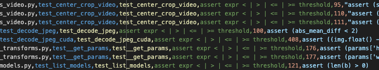
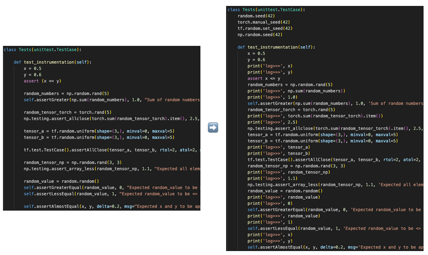

# Flaky-Test-Exp

## Task 1

Contains summaries of two papers related to software engineering for ML

## Task 2

Automated detection of approximate assertions (as defined by the papers
referenced in Task 1) for the PyTorch, Qiskit, and Tensorflow libraries in an
extensible framework.

As an example, here are a few approximate assertions found in PyTorch:



To see the results, check out `pytorch_assertions.csv`,
`qiskit_assertions.csv`, and `tensorflow_assertions.csv`, which document 53, 392,
and 14 approximate assertions in the respective libraries.

Detecting potentially flaky tests is the first step towards fixing them (see
Task 3), and the assertion finder automatically does it quickly (less than 5
seconds) and accurately for large libraries, reducing the human time involved.

To run the `AssertSpecFinder` tool on a different Python project, you will need
either the relative or absolute path of the directory you would like to search
for tests as well as a name for the prefix of the output csv file.

The general code to generate a full report of assertions is as follows:

```
import AssertSpecFinder

finder = AssertSpecFinder("csv_name_prefix")
finder.run("path_to_project")
```

For example, to generate the assertions in qiskit-aqua, it would be the
following, assuming your relative path aligns with this projects directory structure:

```
import AssertSpecFinder

finder = AssertSpecFinder("qiskit")
finder.run("task2results/qiskit-aqua-main/")
```

## Task 3

Automated seeding and logging of approximate assertions, with the option to
provide the line number of the assertion or automatically instrument all
approximate assertions in a function.

This saves time so humans don't have to manually look through to make sure seeds
are set wherever appropriate, and can reduce flakiness by up to 50%, while also
making the debugging process faster.

As an example, `dummy_assertions.py` is provided, with the final output being
`dummy_assertions_final.py`:



To instrument other pieces of code, run `instrumentory.py` with command line
arguments for the file, test function name, and (optionally) the line number,
for example to achieve the default behavior the command is

```
python -m instrumentor --test_file dummy_assertions.py --test_name test_instrumentation
```
